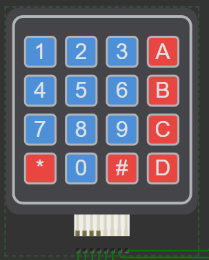

# Tarefa 1 Unidade 4 Capitulo 2
Microcontroladores - GPIO

Para cobrir os requisitos estabelecidos nas instruções da **[Tarefa 1 U4C2](https://moodle.embarcatech.cepedi.org.br/pluginfile.php/2298/mod_assign/introattachment/0/TAREFA%201%20-%20%20AS_U4C2O1234A_14_01_2025%20-%20V1.pdf?forcedownload=1)** implementou-se um sistema em que todas as teclas do teclado numérico (keypad) emite um som com uma frequência específica. Além disso, as teclas de 1 a 7 foram programadas para acionar diferentes combinações de iluminação nos LEDs RGB, totalizando sete modos distintos de funcionamento.

 **[Link do vídeo](https://drive.google.com/file/d/1M0GMij05nkDtDQyBv4DyMigZ-82C6WGJ/view)**

# Pré-requisitos
- Ter acesso  ao ambiente Wokwi.com
